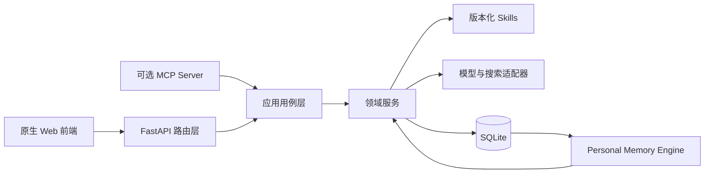
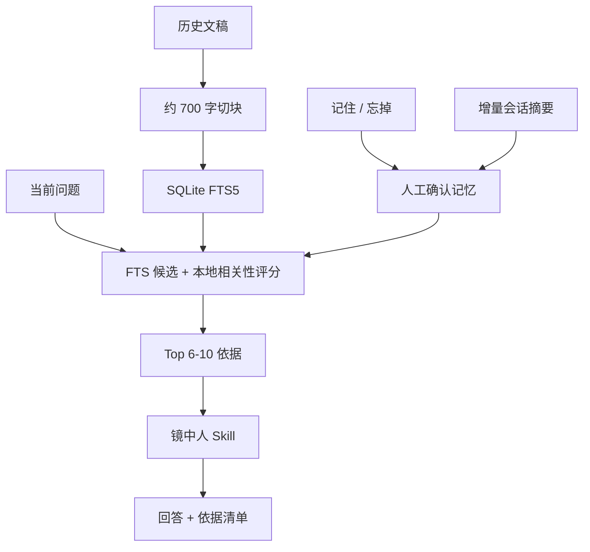

# Architecture

## 形态

匣中镜是本地优先的模块化单体。当前选择单进程、SQLite 和原生前端，是为了让个人创作者可以低成本安装、备份和迁移，而不是为了模拟大型 SaaS。

## 模块边界

- `api/`：HTTP 输入验证、状态码和响应协议，不承载创作规则。
- `application/`：生成和书库等用例编排，可同时被 Web 与 MCP 复用。
- `services/`：创作、蒸馏、对话、书库、设置、封面和持久化领域逻辑。
- `product_skills/`：模型执行契约，和 Python 业务代码分离。
- `knowledge/`：空白安装使用通用基线；个人 Skill 由数据库版本化管理。
- `static/js/`：按项目、素材、生成、对话、书库、DNA、封面等领域拆分。

## Personal Memory Engine v1

每个来源保留类型、文件名、文稿 ID、片段序号、置信度和状态。用户界面展示的只是实际输入模型的来源证据与运行阶段，不展示隐藏 chain-of-thought。

## 数据迁移

`schema_migrations` 记录正式数据库迁移。Personal Memory Engine v1 新增：

- `creator_memory_chunks`
- `creator_memories`
- `dialogue_feedback`
- `dialogue_memory_checkpoints`

迁移只新增表和索引，不覆盖 `app_state`、风格版本、项目、对话或书库数据。原文分块采用幂等同步，相同文稿不会重复写入。

Creator Onboarding v2 新增：

- `library_books`：用户书库目录、来源状态与素材计数。
- `book_personas`：动态书中人及其多书绑定、表达气质和边界。
- `book_citations.book_id`：把历史引文迁移到稳定书籍标识。

空白数据库不会创建维护者书籍或人物。旧实例只有在确实存在相应历史引文时，才会把旧书目和人物关系回填为正式记录。所有迁移均通过 `schema_migrations` 保持幂等。

## Creator Onboarding

`services/onboarding_service.py` 聚合七项只读状态：模型真实验证、创作者身份、历史文稿与已发布 DNA、精神书库、镜中人记忆、书中人和首次生成项目。它不复制数据，也不改变现有用户的首页；只有没有任何私人数据的空白安装会默认进入引导页。

书库目录是全局轻量状态，创作页可读取书目和项目选书；书库原句、质量诊断与筛选结果只在精神书库页渲染，防止资料内容泄漏到其他页面。

## 扩展边界

在出现真实需求前不拆微服务。以下条件满足任一项时再考虑拆分：

- 多用户账户和租户隔离成为正式需求。
- 图片任务需要独立队列和 GPU 调度。
- SQLite 写入锁成为可复现的性能瓶颈。
- MCP 与 Web 需要独立扩缩容和鉴权策略。
